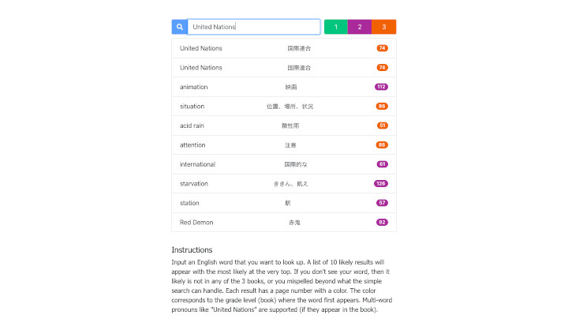

# [Total English Dictionary](https://teflassistant.com/tea-dictionary/)
A dictionary for the Total English book series used in public junior high schools across Japan.

## Purpose/Goal
To have an easy to use dictionary tool to assist teachers in making worksheets while only using words within the material that is relevant to the lessons.

## Operation
* Start typing an English word in the search box and a list of words will appear to help you narrow down what you are looking for.
* Japanese definitions are given in the center column.
* The number and color in the right column correspond to the page (number) and grade level (color) that the word first appears in the series of books.
* The closest match to the word you input is at the top of the results that appear.

## Tech/Libraries Used
* HTML
* CSS
* JavaScript
* React
* Bootstrap

## Problems/Solutions
Finding a simple way to compensate for typos when a word is entered was a small challenge at first, but I ended up settling on using the "edit distance" way of finding out which word was most likely the one being searched for.

## More Information
It is part of my TEFL website, [teflassistant.com](https://teflassistant.com/tea-dictionary/)
